<!-- ================= PHASE 1: ANIMATED TERMINAL BANNER ================= -->
<picture>
  <source media="(prefers-color-scheme: dark)" srcset="dark.svg">
  <source media="(prefers-color-scheme: light)" srcset="light.svg">
  
</picture>

  

<!-- ================= PHASE 4: SOCIAL BADGES ================= -->

&nbsp;&nbsp;

&nbsp;&nbsp;

&nbsp;&nbsp;

  

<!-- ================= PHASE 2: STATS CARDS ================= -->
<!-- 1. Full-Width Streak Card -->
<picture>
  <source media="(prefers-color-scheme: dark)" srcset="https://streak-stats.demolab.com?user=sailgaikwad&theme=dark&background=0A101F&border=22D3EE&stroke=22D3EE&ring=10B981&fire=10B981&currStreakNum=22D3EE&sideNums=94A3B8&currStreakLabel=10B981&sideLabels=94A3B8&dates=64748B">
  <source media="(prefers-color-scheme: light)" srcset="https://streak-stats.demolab.com?user=sailgaikwad&background=F8FAFC&border=0891B2&stroke=0891B2&ring=059669&fire=059669&currStreakNum=0891B2&sideNums=64748B&currStreakLabel=059669&sideLabels=64748B&dates=94A3B8">
  
</picture>

 

<!-- 2. Self-Hosted Stats & Top Languages Side-by-Side (49% width each) -->
<!-- Replace https://YOUR-VERCEL-APP.vercel.app with your deployed Vercel URL -->
<picture>
  <source media="(prefers-color-scheme: dark)" srcset="https://YOUR-VERCEL-APP.vercel.app/api?username=sailgaikwad&show_icons=true&hide_border=false&hide_rank=true&bg_color=0A101F&border_color=22D3EE&title_color=22D3EE&icon_color=10B981&text_color=94A3B8">
  <source media="(prefers-color-scheme: light)" srcset="https://YOUR-VERCEL-APP.vercel.app/api?username=sailgaikwad&show_icons=true&hide_border=false&hide_rank=true&bg_color=F8FAFC&border_color=0891B2&title_color=0891B2&icon_color=059669&text_color=64748B">
  
</picture>
<picture>
  <source media="(prefers-color-scheme: dark)" srcset="https://YOUR-VERCEL-APP.vercel.app/api/top-langs/?username=sailgaikwad&layout=compact&hide_border=false&bg_color=0A101F&border_color=22D3EE&title_color=22D3EE&text_color=94A3B8">
  <source media="(prefers-color-scheme: light)" srcset="https://YOUR-VERCEL-APP.vercel.app/api/top-langs/?username=sailgaikwad&layout=compact&hide_border=false&bg_color=F8FAFC&border_color=0891B2&title_color=0891B2&text_color=64748B">
  
</picture>

  

<!-- ================= PHASE 3: CONTRIBUTION SNAKE ================= -->
<!-- Only active once the snake GitHub Action runs green on your repository -->
<picture>
  <source media="(prefers-color-scheme: dark)" srcset="https://raw.githubusercontent.com/sailgaikwad/sailgaikwad/output/github-contribution-grid-snake-dark.svg">
  <source media="(prefers-color-scheme: light)" srcset="https://raw.githubusercontent.com/sailgaikwad/sailgaikwad/output/github-contribution-grid-snake-light.svg">
  
</picture>

